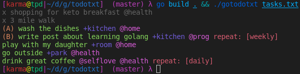

# todotxt
`todotxt`  commandine program displays tasks read from a file to terminal using lots of funny colors.

This is an excercise during learning go language. This is also a try to use test driven development.

The program parses a text file with todo tasks (one per line) according to [todo.txt format](https://github.com/todotxt/todo.txt)

## Installing

You can compile and build a binary with: 

```shell
go build .
```

and execute it giving todo file as commandline argument:

```shell
./gotodotxt tasks.txt 
```

## Screenshot
If the contents of tasks.txt is:
```
+ shopping for keto breakfast @health
+ 3 mile walk
(A) wash the dishes +kitchen @home
(B) write post about learing golang +kitchen @prog repeat:weekly
play with my daughter +room @home
go outside +park @health
drink great coffee @selflove @health repeat:daily
```
then the results renders like this:



## Contributing

Can you contribute? Sure.

## Links

- Repository: https://github.com/kamchy/todotxt/
- Issue tracker: https://github.com/kamchy/todotxt/issues
- Related projects:
  - Original idea project: https://github.com/todotxt/todo.txt


## Licensing
The code in this project is licensed under GNU GPL licence
